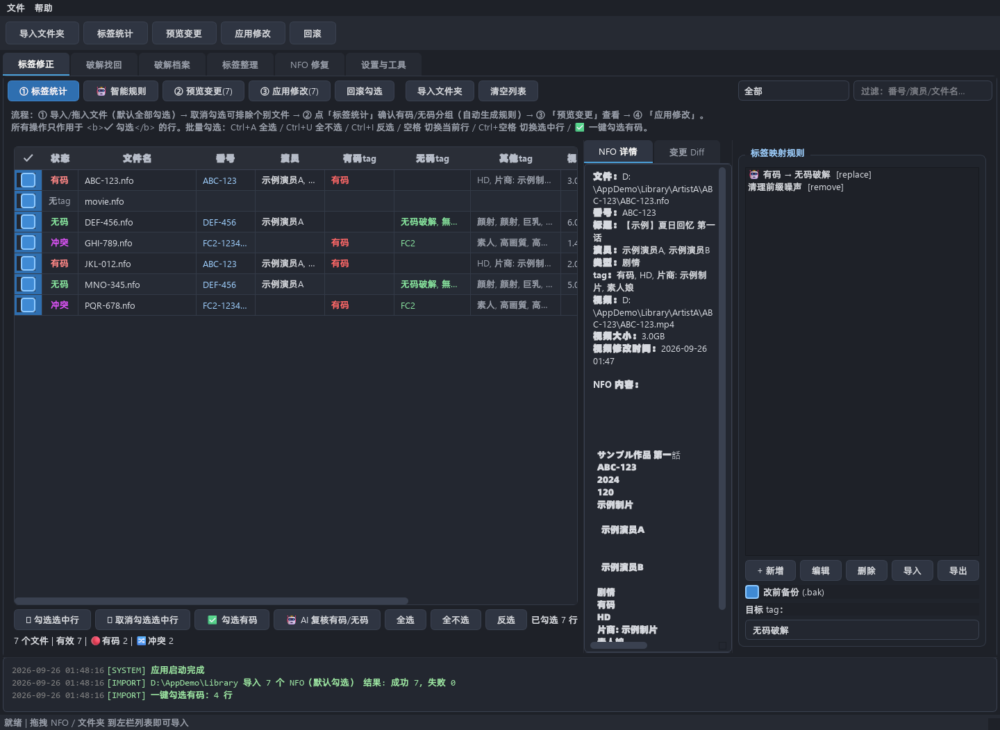
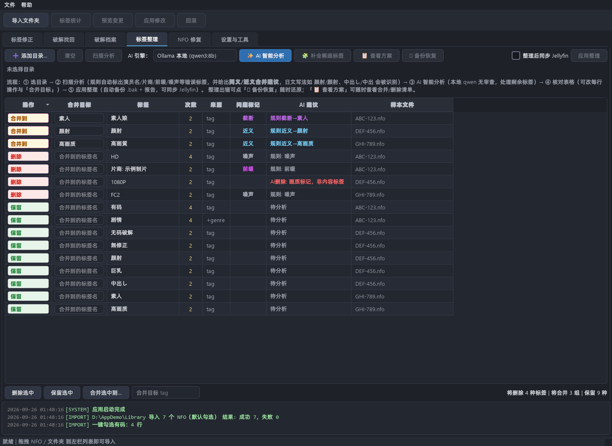
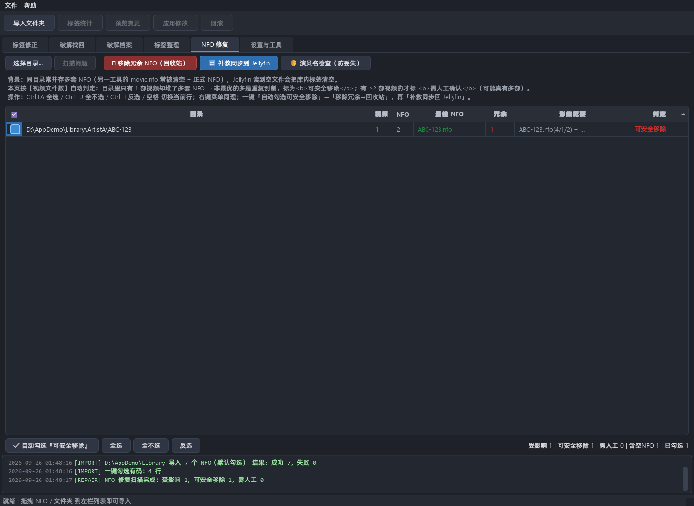
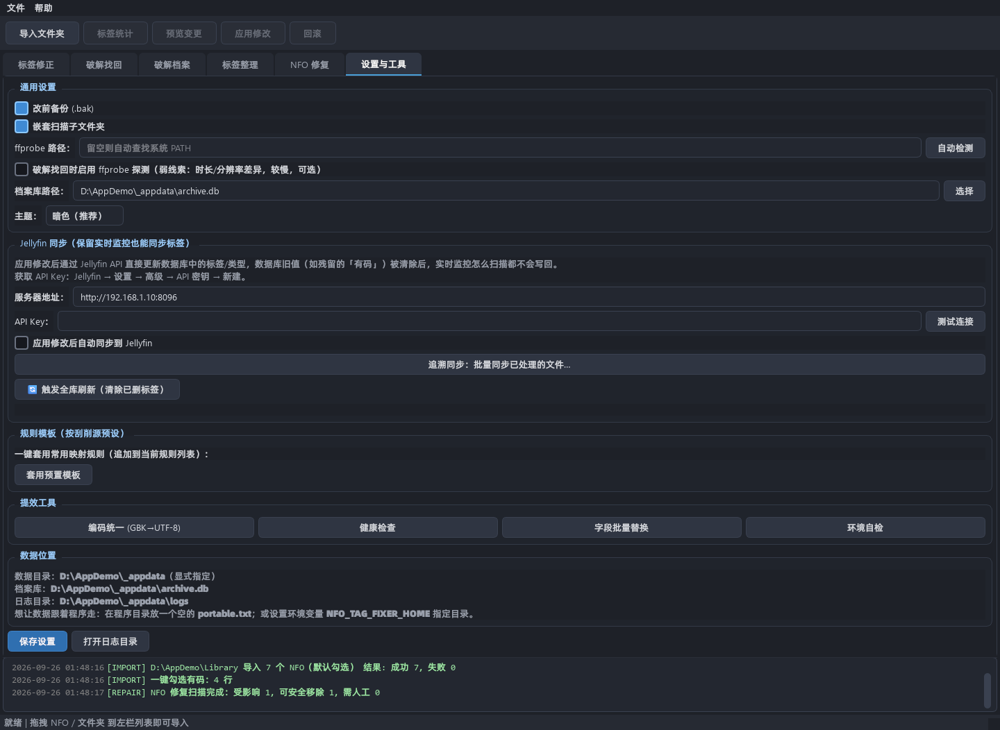
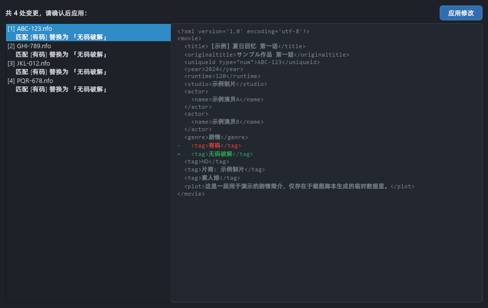

# NFO 标签批量修改工具

[](https://github.com/coldeve2022/nfo-tag-fixer/actions/workflows/tests.yml)
[](https://github.com/coldeve2022/nfo-tag-fixer/releases)
[](LICENSE)
[](https://www.python.org/)
[](#系统要求)

> 批量修正本地媒体库 NFO 文件里的 `tag` / `genre` 标签，附带标签清理、NFO 修复、
> 编码统一与 Jellyfin 同步。**纯本地运行，不上传任何数据。**

一个常见场景：某个视频被"替换/流出"版本取代后，NFO 里的标记还停留在旧的
"有码"，于是 Jellyfin 的筛选和侧栏全是错的。手工改几千个 NFO 不现实，
这个工具把这件事压成四次点击。

---

## 目录

- [它解决什么问题](#它解决什么问题)
- [界面](#界面)
- [系统要求](#系统要求)
- [安装](#安装)
- [快速上手（5 分钟）](#快速上手5-分钟)
- [六个页面](#六个页面)
- [数据结构与隐私](#数据结构与隐私)
- [常见问题](#常见问题)
- [命令行](#命令行)
- [打包发布与版本管理](#打包发布与版本管理)
- [项目结构](#项目结构)
- [开发与贡献](#开发与贡献)

---

## 它解决什么问题

| 场景 | 做法 |
|------|------|
| **批量改 tag** | 把"有码"类标记批量替换 / 追加 / 删除成目标标记。改前自动 `.bak`，可一键回滚 |
| **标签清理** | 演员名、片商、系列被刮削源塞进了 tag；同义词多种写法；同一内容被截成不同长度的碎片标签 —— 规则层 + 本地 AI 一次性归并 |
| **NFO 冲突修复** | 同一目录并存多套 NFO（第三方刮削器的 `movie.nfo` 常被清空），Jellyfin 读到空文件就会把库内标签清空。按视频文件数自动判定哪些是可安全移除的重复刮削 |
| **编码统一** | 刮削源输出 GBK、Jellyfin 按 UTF-8 读 → 中文乱码。一键统一为 UTF-8 |
| **库健康检查** | 孤儿 NFO（有 NFO 没视频）、缺 NFO 的视频、文件名与番号不一致、标记互相矛盾 |
| **同步回 Jellyfin** | 改完 NFO 后 Jellyfin 数据库里还留着旧标签，通过官方 REST API 直接更新，或触发全库刷新 |

**这个工具不做的事**：不下载任何内容、不访问任何刮削站点、不改动视频文件本身。
它只读写 NFO（XML）以及自己的配置与档案库。

---

## 界面


*标签修正页：左列表（勾选决定处理范围）／中 NFO 详情与 diff／右映射规则面板*


*标签整理页：规则层自动标出演员名/片商/前缀/噪声，并给出同义与截断合并建议*


*NFO 修复页：按视频文件数自动判定"可安全移除"的重复刮削 NFO*


*设置与工具页：Jellyfin 同步、环境自检、编码统一、健康检查*


*预览弹窗：左列逐条列出变更，右侧是改前/改后 XML 的 diff*

---

## 系统要求

| 项目 | 要求 |
|------|------|
| 操作系统 | Windows 10/11、macOS 12+、主流 Linux 桌面 |
| Python（源码运行） | 3.10 或更高 |
| 图形环境 | 能运行 Qt 6 的桌面会话 |
| 可选：ffprobe | 「破解找回」的时长/分辨率弱线索；不装只是少一条打分依据 |
| 可选：Ollama | 本地 AI 标签整理（`ollama pull qwen3:8b`，约 5 GB，12 GB 显存可流畅运行） |

> 发行包为 Windows x64 `onedir` 版本，解压即用、无需安装 Python。
> 其它平台请用源码方式运行（PySide6 跨平台，代码里没有平台专属逻辑；
> 打开文件夹等操作已做跨平台处理）。

---

## 安装

### 方式一：下载发行包（Windows，推荐）

到 [Releases](https://github.com/coldeve2022/nfo-tag-fixer/releases) 下载
`nfo-tag-fixer-vX.Y.Z-win64.zip`，解压到任意目录，双击
`NFO标签批量修改工具.exe`。附件里有 `.sha256` 可校验完整性。

### 方式二：源码运行

```bash
git clone https://github.com/coldeve2022/nfo-tag-fixer.git
cd nfo-tag-fixer
python -m venv .venv
# Windows: .venv\Scripts\activate     macOS/Linux: source .venv/bin/activate
pip install -r requirements.txt
python main.py
```

---

## 快速上手（5 分钟）

### 场景：把整个库里有码标签的文件都改成"无码破解"

**第 1 步 — 导入**
在「标签修正」页把文件夹（如 `D:\Media\Library`）**拖进左侧文件列表**，或点
「导入文件夹」。会自动嵌套扫描所有 NFO，**导入的文件默认全部勾选**。

**第 2 步 — 决定处理范围**
所有操作（预览 / 应用 / 回滚）**只作用于 ✓ 勾选的行**：

| 方式 | 操作 |
|------|------|
| 鼠标 | 按住 `Ctrl`/`Shift` 多选 → 工具栏「☑ 勾选选中行」，或右键菜单 |
| 快捷键 | `Ctrl+A` 全选 / `Ctrl+U` 全不选 / `Ctrl+I` 反选 / `空格` 切换当前行 / `Ctrl+空格` 切换所有选中行 |
| 一键 | 「✅ 勾选有码」自动勾选所有「有码tag」列非空的行 |

**第 3 步 — 一键智能建议**
点「① 标签统计」→「✨ 一键智能建议」：左列自动列出有码类标记、右列列出无码类标记，
选一个目标写法，点「确定」后**自动生成一条替换规则**。

**第 4 步 — 预览并应用**
「② 预览变更」看 diff（红=删、绿=增），确认后点「③ 应用修改」。
每个文件修改前自动生成 `.bak`。

**第 5 步 — 后悔药**
勾选要回滚的文件 → 「回滚勾选」→ 从 `.bak` 恢复。

> 最简流程：导入 → 标签统计（一键智能建议 → 确定）→ 预览 → 应用。全程 4 次点击。

---

## 六个页面

### ① 标签修正（主页面）

```
[① 标签统计] [🤖 智能规则] [② 预览变更] [③ 应用修改] [回滚勾选] | [导入文件夹] [清空列表]
[🔴 只看有码 ▾] [过滤: 番号/演员/文件名…]
┌─────────────┬──────────────┬──────────────┐
│ 文件列表      │ NFO 详情/Diff │ 映射规则面板   │
└─────────────┴──────────────┴──────────────┘
```

- **列**：✓（决定处理范围）｜状态｜文件名｜番号｜演员｜**有码tag（红）**｜
  **无码tag（绿）**｜其他tag｜视频大小｜修改时间
- 所有列可点击排序（番号/大小/时间按数值而非字符串）
- 状态筛选：🔴只看有码 / 🟢只看无码 / 🔀冲突 / 🟡待确认 / 无tag
- **标记可能写在 `tag` 或 `genre`**，分组、状态判断、映射替换同时覆盖两个字段
- 规则 = 「匹配哪些标记 + 怎么处理」，支持 **替换 / 追加 / 删除** 与正则匹配；
  规则可导出 JSON，换电脑导入即用

### ② 破解找回

输入演员名 → 多线索打分排序，把「最可能是最近批量处理过、且标记还没改」的文件
排到最前。每条线索都在「线索」列展示，鼠标悬停分数可看全部依据；勾选后一键应用
并写入永久档案。

打分权重：修改时间聚类（最强）> 文件大小异常 > 文件名特征 > NFO 现状 >
ffprobe（可选弱线索）。

### ③ 破解档案

每次应用修改都会建档（番号、演员、原标记、新标记、视频大小、时间）。
支持按番号/演员检索、导出 CSV、双击打开所在文件夹。

### ④ 标签整理（AI 智能清洗）

- **规则层（免费、确定性）**：归一化比较（全角/半角、平/片假名、简繁/日文汉字、
  长音符、标点空白），合并明确同义词；同一内容被截成不同长度时合并到主流写法。
  带护栏防误并（含数字/字母的短词、被动形假名后缀、纯数字短词都不合并）
- **AI 层（可选）**：本地 Ollama `qwen3:8b`，**无审查、不上传数据**；也可选
  DashScope 云端引擎（注意官方 API 对部分内容有输入审查）
- AI 结果自动缓存到 `logs/organize_ai_*.json`，重开软件/重新扫描自动回填，无需反复跑
- 应用前弹「变更报告」（合并清单 / 删除清单 / 保留统计），可导出 HTML
- **🧩 补全稀疏标签**：从标题挖类型标签补进 `<tag>`，给标签又少又重复的条目增加
  检索区分度；写入前会弹可读的审核表格（文件维度 + 标签维度双视图）
- **↩ 备份恢复**：列出目录树里所有 `.nfo.bak`，支持搜索、排序、双击预览差异后多选恢复

### ⑤ NFO 修复

针对"同目录多套 NFO 导致标签被清空"：

- **智能判定**（用视频文件数）：目录里只有 1 部视频却堆了多套 NFO → 非最优的多是
  重复刮削，标「可安全移除」；有 ≥2 部视频的才标「需人工确认」
- **移除冗余 NFO**：只移除全空的残壳与单视频目录里的重复刮削，**绝不删除最优 NFO、
  绝不动视频**，全部进系统回收站（`send2trash`）可恢复；回收站不可用时降级到本地
  `.nfo_trash_<时间>` 目录
- **补救同步到 Jellyfin**：把受影响目录最优 NFO 的正确标签重新推送回 Jellyfin
- **演员名检查**：检测「tag 里含演员名、但 `<actor>` 为空」的影片并可一键补回

### ⑥ 设置与工具

- **通用**：改前备份开关、嵌套扫描开关、主题（深色/浅色，保存即生效）、ffprobe 路径与开关
- **Jellyfin 同步**：服务器地址 + API Key → 「测试连接」→ 勾选「应用修改后自动同步」；
  另有「追溯同步」与「🔄 触发全库刷新」
- **提效工具**：编码统一（GBK→UTF-8）、健康检查、字段批量替换、**环境自检**
- **数据位置**：直接显示实际生效的数据目录、档案库与日志路径（不写死任何盘符）

---

## 数据结构与隐私

**完全本地运行，不发送遥测、不上报任何数据。** 唯一的网络请求是你主动配置的：

| 目标 | 何时 | 说明 |
|------|------|------|
| `http://localhost:11434` | 使用「标签整理 / AI 复核」时 | 本地 Ollama，数据不出本机；请求显式绕过系统代理 |
| 你填写的 Jellyfin 地址 | 点「测试连接 / 同步」时 | 局域网或自建服务器 |
| `dashscope.aliyuncs.com` | **仅当你主动选择云引擎并填入自己的 API Key** 时 | 会把标签词条发到阿里云 |

### 数据目录

优先级（`core/appdirs.py: resolve_data_dir()`）：

1. 环境变量 `NFO_TAG_FIXER_HOME`
2. 程序目录下存在 `portable.txt` → **便携模式**，数据跟着程序走
3. 程序目录可写 → 直接用程序目录（绿色版默认行为）
4. 以上都不行（如装在 `C:\Program Files`）→ `%APPDATA%\nfo-tag-fixer`
   （macOS 为 `~/Library/Application Support/`，Linux 为 `$XDG_CONFIG_HOME`）

`--doctor` 会打印实际生效的目录。

| 文件 | 内容 | 是否进仓库 |
|------|------|-----------|
| `settings.json` | 你的路径、Jellyfin 地址与 API Key | ❌ `.gitignore` |
| `rules.json` | 你的映射规则 | ❌ |
| `archive.db` | 破解档案（SQLite，含文件路径） | ❌ |
| `logs/YYYY-MM-DD.log` | 操作留痕（含文件路径） | ❌ |

配置模板见 [`config.example.json`](config.example.json)。

### 写盘安全

- 所有 NFO 与配置都是**原子写**（临时文件 + `os.replace`），断电或被杀进程不会留下坏文件
- 内容没有实际变化时**不写盘**（不改 mtime —— mtime 是"破解找回"打分的最强线索）
- 配置加载时自动**自愈**：残留的、本机不可达的路径（比如换机器后不存在的盘符）
  会被清空并回退到默认值，而不是启动即崩

---

## 常见问题

**Q：为什么有的文件显示「待确认」？**
它的标记既不匹配有码类也不匹配无码类（例如只有画质/题材标记）。跑一次
「① 标签统计 → 一键智能建议」就会归组。

**Q：同一个文件既有"有码"又有"FC2"，正常吗？**
正常，这正是"替换过但标记没改干净"的典型。应用替换规则后"有码"会变成目标标记。

**Q：会不会弄坏我的 NFO？**
修改前一定生成 `.bak`；写入是原子操作；预览里的 diff 就是最终结果。
另外「应用」只动 `tag` / `genre` 字段（除非你主动用字段批量替换）。

**Q：AI 会把我的数据传上去吗？**
默认引擎是**本地 Ollama**，数据不出本机。只有你主动切到云端引擎并填自己的
API Key 时才会发到阿里云。

**Q：日志和档案在哪？**
「设置与工具」页底部的「数据位置」直接显示实际路径，也有「打开日志目录」按钮。

**Q：为什么"破解找回"默认不用 ffprobe？**
逐文件探测较慢，且只是弱线索。需要时在设置页开启并配置路径（「自动检测」
会依次查配置路径、程序目录、PATH 与各平台常见安装位置）。

**Q：换电脑后打不开/报路径错误？**
配置里的绝对路径会在加载时自愈（不可达则清空回默认），档案库路径也是。
如果仍异常，跑 `NFO标签批量修改工具.exe --doctor` 把输出贴到 Issue 里。

---

## 命令行

```bash
python main.py               # 启动图形界面
python main.py --doctor      # 环境自检（数据目录可写性、ffprobe、可选依赖、硬件编码实测）
python main.py --version     # 打印版本号
```

`--doctor` 的输出在被重定向时自动切 UTF-8，直接粘贴到 Issue 不会乱码。

---

## 打包发布与版本管理

```bash
python scripts/build_release.py                # 完整流程：图标 → 版本资源 → 测试 → PyInstaller → zip → SHA256
python scripts/build_release.py --skip-tests   # 跳过测试（不推荐）
```

产物在 `dist/`：`nfo-tag-fixer-vX.Y.Z-win64.zip` 与同名 `.sha256`。

推送 `v*` 标签会触发 `.github/workflows/release.yml` 自动构建并创建 Release；
推送 `main` 会触发 `.github/workflows/tests.yml`（静态检查 + 隐私守卫 + 三平台测试矩阵）。

### 版本号只有一处来源

[`version.py`](version.py) 的 `__version__`。窗口标题、关于对话框、exe 版本资源、
`pyproject.toml` 全部引用它；release workflow 会校验 `version.py` 与
`pyproject.toml` 一致，不一致直接失败。

| 目录 | 用途 | 是否提交 |
|------|------|---------|
| 仓库根 | 源码（唯一真相） | ✅ |
| `build/` | PyInstaller 中间产物（含生成的版本资源） | ❌ |
| `dist/` | 打包产物 | ❌ |
| `release/` | 手工归档的历史发行包 | ❌ |

### 发版工作流

```bash
# 1. 改 version.py 的 __version__ 和 CHANGELOG.md
# 2. 本地跑一遍 CI 会跑的命令
ruff check . --select E4,E7,E9,F --ignore E501,E702,E741
python -m pytest -q
# 3. 提交并推送，等 CI 绿
git commit -am "chore(release): v1.3.0"
git push origin main
# 4. 绿了再打标签（标签触发自动构建 + 创建 Release）
git tag -a v1.3.0 -m "v1.3.0"
git push origin v1.3.0
```

> 顺序很重要：**先推代码、等 CI 绿、再打标签**。反过来等于给一份没验证过的代码发版。

---

## 项目结构

```
nfo-tag-fixer/
├── main.py                    # 入口（GUI / --doctor / --version）
├── version.py                 # 版本号唯一来源
├── config.py                  # 配置与规则管理（原子写 + 加载自愈）
├── core/
│   ├── appdirs.py             # 数据目录解析、可写探测、原子写、路径可达性
│   ├── console.py             # 控制台 UTF-8 与子进程环境
│   ├── toolchain.py           # 外部工具定位（ffprobe 多路兜底 + 真实能力探测）
│   ├── nfo.py                 # NFO 解析/写入/编码检测（原子写 + 脏标记）
│   ├── scanner.py             # 拖拽导入、嵌套扫描、去重、关联视频
│   ├── tag_analyzer.py        # 标记频率统计与分组建议
│   ├── mapper.py              # 映射引擎（替换/追加/删除 + 正则）
│   ├── finder.py              # 破解找回：多线索打分
│   ├── archive.py             # 破解档案库（SQLite）
│   ├── nfo_repair.py          # 重复/空 NFO 检测与回收站移除
│   ├── tag_organizer.py       # 标签整理：规则层 + AI 层
│   ├── tag_enrich_model.py    # 稀疏标签补全的数据模型
│   ├── jellyfin.py            # Jellyfin REST 客户端
│   └── logger.py              # 日志（界面 + 落盘）
├── ui/
│   ├── main_window.py         # 主窗口（6 页 Tab + 工具栏 + 日志面板）
│   ├── styles.py              # 两套主题 + 按主题自适应的单元格配色
│   ├── fonts.py               # 字体探测（不写死字体族）
│   ├── widgets.py             # 拖拽/勾选表格、日志面板、diff 视图
│   ├── dialogs.py             # 统计分组/规则编辑/二次确认
│   ├── worker.py              # 后台线程封装（进度/取消/暂停）
│   └── pages/                 # 六个页面
├── scripts/build_release.py   # 打包脚本
├── tools/
│   ├── make_icon.py           # 图标生成（用 Qt 画，不引入额外依赖）
│   ├── audit/ast_audit.py     # 静态审计：调用但未定义 / 重复定义 / 读未赋值
│   └── dev/                   # 手动运行的开发辅助脚本
└── tests/                     # pytest 用例（含 GUI 冒烟与隐私守卫）
```

---

## 开发与贡献

```bash
pip install -r requirements-dev.txt
python -m pytest -q                       # 全部用例（约 15 秒）
ruff check . --select E4,E7,E9,F --ignore E501,E702,E741
```

几条必须遵守的约定（详见 [CONTRIBUTING.md](CONTRIBUTING.md)）：

- **直接改 `nfo.root` 之后必须调用 `nfo.mark_dirty()`**，否则 `save()` 会认为
  没改过而跳过写盘 —— 用户点了"应用"却什么都没发生，且不报错。
  `tests/test_write_paths.py` 逐条覆盖这些路径。
- **不要写死字体、盘符、内网地址**；单元格颜色要经 `ui.styles.cell_color()` 映射。
- **不要提交任何个人数据**；`tests/test_privacy.py` 与 CI 的隐私守卫会拦住。

安全问题请见 [SECURITY.md](SECURITY.md)（请勿开公开 Issue）。

## 许可

[MIT](LICENSE)
